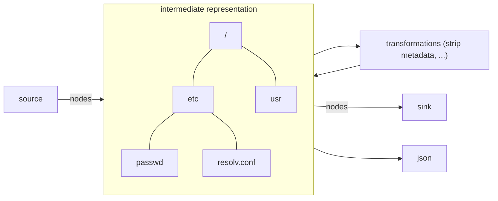

# abstractfs

[](https://goreportcard.com/report/github.com/malt3/abstractfs)
[](https://pkg.go.dev/github.com/malt3/abstractfs)

*intermediate representation for directory trees / filesystems with fine control over metadata*

## Quick start

```shell-session
go install github.com/malt3/abstractfs@latest
abstractfs json --source-type tar --source /path/to/archive.tar | yq -P
abstractfs json --source-type dir --source /path/to/directory | yq -P
abstractfs convert --source-type dir --source /path/to/directory --sink-type tar --sink /path/to/archive.tar
```

## Architecture



## Design goals

- Simple
- Arbitrary input and output formats
	- directory of a mounted filesystem (`dir`)
	- archive formats (tar, cpio, zip)
    - package formats (rpm, deb)
    - container image formats (oci image, oci layer)
    - filesystems (squashfs, fat, ext4)
    - go fs.FS ([embed.FS](https://pkg.go.dev/embed))
	- in-memory sources and sinks
    - user-extensible, programmable via an interface
- Efficient in-memory representation
- Clean interfaces for [sources](https://pkg.go.dev/github.com/malt3/abstractfs-core/api#Source) and [sinks](https://pkg.go.dev/github.com/malt3/abstractfs-core/api#Sink)
- Human readable metadata representation
- File contents stored in abstract CAS and can come from anywhere (even other computers)
  - represent hash using [Subresource Integrity Format](https://developer.mozilla.org/en-US/docs/Web/Security/Subresource_Integrity)
- Composable (support overlaying / nesting / merging operations)
- Support reproducible / repeatable operations / transformations as event stream
	- add / remove a file
	- replace contents or metadata
	- serializable event format
- Uses canonical representation by default
- Explicitly support the absence / presence of metadata
- Should allow for metadata normalization operations
	- Strip attributes, normalize timestamps...
    - Overlay metadata from a different source
- Designed for file system forensics / diffing / reproducible builds

## Supported sources and sinks

|          | Source | Sink | xattr | CAS Source |
| -------- | ------ | ---- | ----- | ---------- |
| dir      | ✅     | 🔜   | 🔜    | ✅         |
| go fs.FS | ✅     | ❌   | 🔜    | ✅         |
| tar      | ✅     | ✅   | ✅    | ✅         |
| cpio     | 🔜     | 🔜   | 🤷    | 🤷         |
| zip      | 🔜     | 🔜   | 🤷    | 🤷         |
| rpm      | 🔜     | 🔜   | 🤷    | 🤷         |
| deb      | 🔜     | 🔜   | 🤷    | 🤷         |
| oci      | 🔜     | 🔜   | 🤷    | 🤷         |
| squashfs | 🔜     | 🔜   | 🤷    | 🤷         |
| fat      | 🔜     | 🔜   | 🤷    | 🤷         |

## Content addressable storage (CAS) backends

- [ ] in-memory
- [ ] dir
- [ ] S3 / object storage

## 🚧 JSON Format

The current format is not stabilized and still work in progress.
